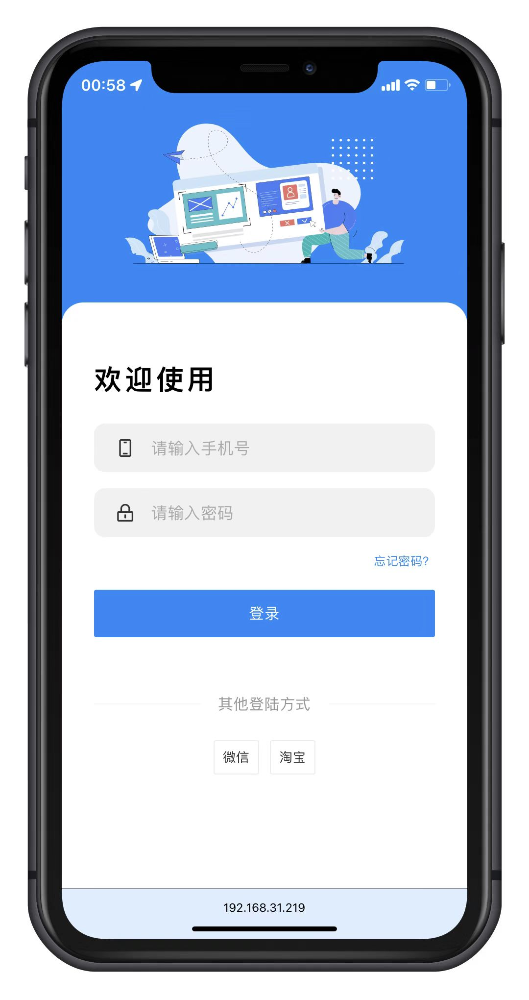
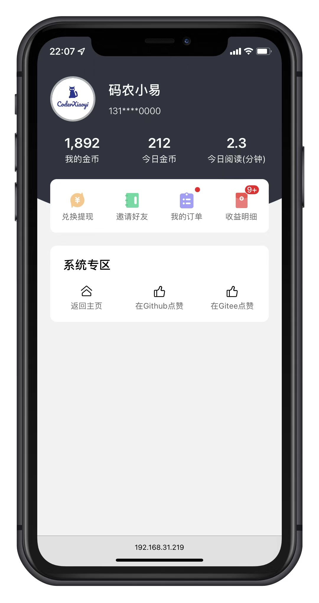
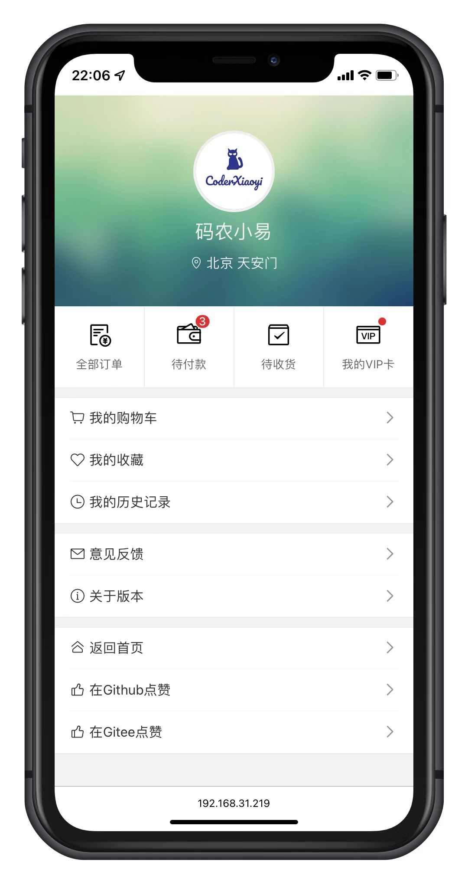
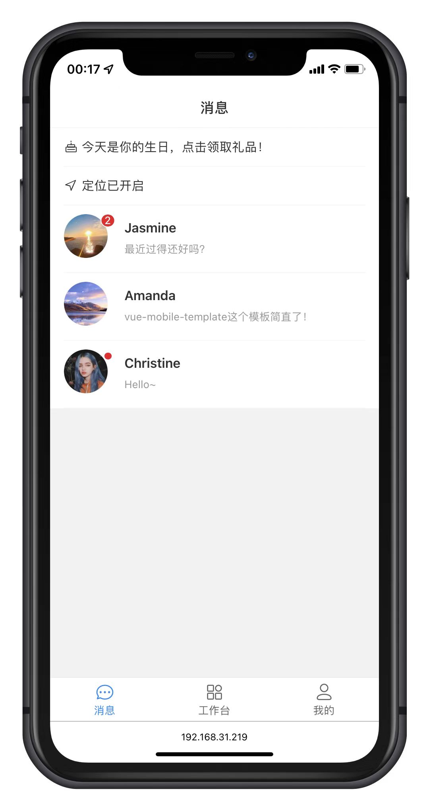
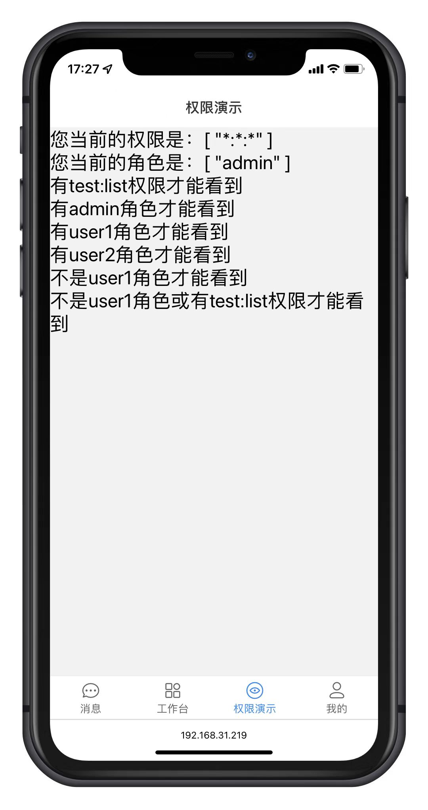

<div align="center">
	
	<p align="center">
        <a href="https://vitejs.dev/" target="_blank">
            
		</a>
	    <a href="https://v3.vuejs.org/" target="_blank">
	        
	    </a>
	    <a href="https://router.vuejs.org/" target="_blank">
	        
	    </a>
	    <a href="https://vant-contrib.gitee.io/vant/" target="_blank">
	        
	    </a>
		<a href="https://pinia.vuejs.org/" target="_blank">
		    
		</a>
		<a href="https://github.com/Coder-XiaoYi/vue-mobile-template/blob/main/LICENSE" target="_blank">
		    
		</a>
	</p>
	<p>&nbsp;</p>
</div>

#### 📅 开源项目的由来

某天因公司业务需求，想寻找一款H5移动端的模板进行二次开发。但搜遍整个HUB都没法找到合适的空模板进行二次开发，所以心血来潮，于是有了 vue-mobile-template 。

#### 🌈 介绍

基于 vue3.x + CompositionAPI + javascript + vite + vant + vue-router-next + pinia 的开源免费移动端模板，希望减少工作量，帮助大家实现快速开发移动端。

vue-mobile-template默认已加入 `Rem布局适配`，可在根目录 `postcss.config.js` 进行修改。

#### ✨ 已内置的功能
- 组件
  - GridCard - 网格卡片
  - MsgList - 消息列表
  - SvgIcon - 矢量图形
- 页面
  - 登录页面
  - 聊天消息列表页面
  - 个人中心页面 * 2	
- 功能
  - 登录、登出
  - 页面权限
  - 指令权限
  - Rem布局适配

#### ⛱️ 线上预览

- <a href="https://coder-xiaoyi.github.io/vue-mobile-template" target="_blank">github 演示</a>
- <a href="https://liupeiqiang.gitee.io/vue-mobile-template" target="_blank">gitee 演示</a>
- Admin账号密码：admin/admin123
- user账号密码：user1/user1

#### 💒 代码仓库

- vue-mobile-template (github):  <a href="https://github.com/Coder-XiaoYi/vue-mobile-template" target="_blank">https://github.com/Coder-XiaoYi/vue-mobile-template</a>
- vue-mobile-template (gitee):  <a href="https://gitee.com/liupeiqiang/vue-mobile-template" target="_blank">https://gitee.com/liupeiqiang/vue-mobile-template</a>

#### 🚧 安装 yarn

- 复制代码(桌面 cmd 运行) `npm install -g yarn`

#### 🏭 环境支持

| Edge                                                                     | last 2 versions                                                                   | last 2 versions                                                                | last 2 versions                                                                |
| ------------------------------------------------------------------------ | --------------------------------------------------------------------------------- | ------------------------------------------------------------------------------ | ------------------------------------------------------------------------------ |
|  |  |  |  |

> 由于 Vue3 不再支持 IE11，故而 vant 也不支持 IE11 及之前版本。

#### ⚡ 使用说明

```bash
# 克隆项目
git clone https://github.com/Coder-XiaoYi/vue-mobile-template.git

# 进入项目
cd vue-mobile-template

# 安装依赖
yarn

# 运行项目
yarn run dev

# 打包发布
yarn run build
```

#### 💯 学习交流加 QQ 群

- 查看开发文档、<a href="" target="_blank">vue-mobile-template</a> 开发文档正在编写中...
- <a target="_blank" href="https://qm.qq.com/cgi-bin/qm/qr?k=eebbYNv7y-uKMpklAvgGlZpF0xI8zYhp&jump_from=webapi"></a>
  


#### ❤️ 鸣谢列表

- <a href="https://github.com/vuejs/vue" target="_blank">vue</a>
- <a href="https://github.com/vuejs/vue-next" target="_blank">vue-next</a>
- <a href="https://github.com/youzan/vant" target="_blank">vant</a>
- <a href="https://github.com/vuejs/vue-router-next" target="_blank">vue-router-nex</a>
- <a href="https://github.com/vuejs/vuex" target="_blank">vuex</a>
- <a href="https://github.com/vuejs/pinia" target="_blank">pinia</a>
- <a href="https://github.com/axios/axios" target="_blank">axios</a>
- <a href="https://github.com/lyt-Top/vue-next-admin" target="_blank">vue-next-admin</a>
- <a href="https://github.com/yangzongzhuan/RuoYi-Vue3" target="_blank">RuoYi-Vue3</a>

#### 💌 支持作者

如果觉得框架不错，或者已经在使用了，希望你可以去 <a target="_blank" href="https://github.com/Coder-XiaoYi/vue-mobile-template">Github</a> 或者
<a target="_blank" href="https://gitee.com/liupeiqiang/vue-mobile-template">Gitee</a> 帮我点个 ⭐ Star，这将是对我极大的鼓励与支持。

#### 🙈 部分框架截屏

<table>
    <tr>
        <td></td>
        <td></td>
    </tr>
	<tr>
		<td></td>
        <td></td>
    </tr>
	<tr>
		<td></td>
		<td></td>
    </tr>
</table>

